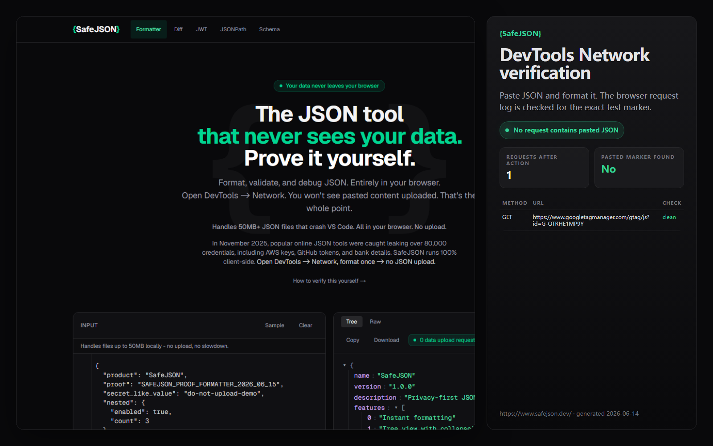
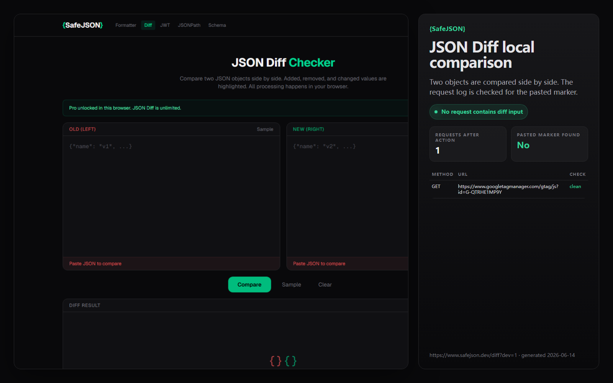
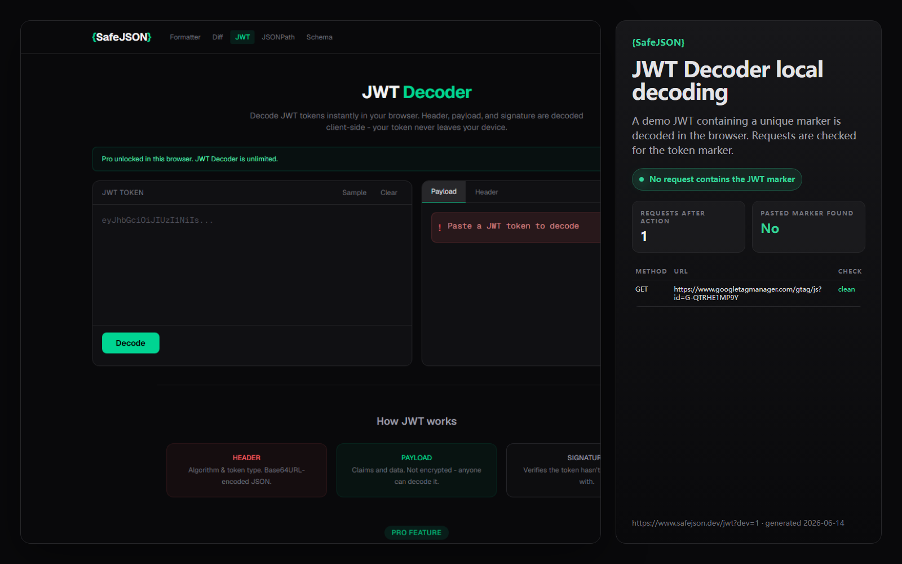

# SafeJSON — Verifiable Local JSON Toolkit

SafeJSON is a browser-local JSON toolkit for developers who inspect
sensitive JSON, JWTs, schemas, logs, and API payloads with no pasted-content
upload during core tool operations. You can verify this with DevTools.

Not just another JSON formatter. A verifiable local JSON toolkit for
sensitive developer workflows.

**Website:** [safejson.dev](https://www.safejson.dev)

---

## How to verify local processing

You do not have to trust the claim.

1. Open [safejson.dev](https://www.safejson.dev)
2. Open DevTools (F12) → Network tab
3. Paste any JSON and run the formatter, diff, JWT decoder, JSONPath, or Schema
4. Confirm: **no request contains your pasted content**

[Detailed verification guide →](https://www.safejson.dev/privacy/verify-local-processing)

---

## What runs locally

| Tool | What it does | Processing | Free / Pro |
|------|-------------|------------|------------|
| JSON Formatter | Instant syntax-highlighted formatting with collapsible tree view | Browser-local | Free |
| JSON Validator | Error detection with line and column numbers | Browser-local | Free |
| JSON Beautifier | Configurable indentation (2, 3, or 4 spaces) | Browser-local | Free |
| JSON Viewer | Collapsible tree view for navigating large objects | Browser-local | Free |
| JSON Parser | Inspect structure, types, and nesting depth | Browser-local | Free |
| CSV ↔ JSON | Convert between CSV and JSON formats | Browser-local | Free |
| JSON Diff | Side-by-side comparison with color-coded results | Browser-local | Pro |
| JWT Decoder | Decode header, payload, and signature | Browser-local | Pro |
| JSONPath Query | XPath-like queries against JSON data | Browser-local | Pro |
| JSON Schema Validator | Validate against draft-04 through 2020-12 (Ajv) | Browser-local | Pro |
| Browser Extension | Auto-detect and format raw JSON on any URL | Browser-local | Free |

All core processing is browser-local. No pasted-content upload. No
pasted-content analytics.

---

## Why SafeJSON exists

Developers paste API responses, JWTs, credentials, config files, logs,
and production payloads into online JSON tools every day — often without
checking where that data goes.

In November 2025, popular JSON formatting sites were found to have leaked
over 80,000 credentials through server-side processing. Attackers were
actively harvesting the data within 48 hours of the discovery.

SafeJSON was built so core JSON workflows are browser-local and verifiable.
You can check the pasted-content boundary yourself with DevTools.

---

## Proof

| Asset | What it shows |
|-------|--------------|
|  | Formatter: no pasted-content upload |
|  | Diff: comparison runs locally |
|  | JWT: token decoded locally |

---

## Pricing

**Core tools are free forever.** Formatter, validator, beautifier, viewer,
parser, and CSV conversion.

**Pro is $5/month or $39/year.** Unlocks JSON Diff, JWT Decoder, JSONPath
Query, and JSON Schema Validator. Pro tools are built for sensitive JSON
workflows — diff, decode, query, and validate with no pasted-content upload
for core tool inputs. One license activates up to 2 devices. 5 free trials per
tool.

Payment and license delivery handled by Lemon Squeezy.

[View pricing →](https://www.safejson.dev/pricing)

---

## Browser extension

Auto-detects and formats raw JSON responses on any URL.

- **Edge Add-ons:** [Live on Microsoft Edge Add-ons](https://microsoftedge.microsoft.com/addons/detail/fjknnlcmogdhhnehcillihjhdgencgeh)
- **Chrome Web Store:** pending review
- **Permissions explained:** [How the extension works](https://www.safejson.dev/extension/permissions)
- **No remote code, no ads, no affiliate injection.** Source is auditable on GitHub.

Manual install from source:

```bash
git clone https://github.com/Json-Lee-git/SafeJSON
# Open chrome://extensions or edge://extensions
# Enable Developer Mode → Load unpacked → select extension/ folder
```

---

## Large JSON support

Formatter and Beautifier tested with 50MB JSON locally. Viewer and Parser
support large local workflows. Large JSON is parsed with a Web Worker so the
UI stays responsive in the tested formatter and beautifier workflows, with no
pasted-content upload.

---

## What SafeJSON does not claim

- Not "zero network requests" (SafeJSON uses GA for aggregate analytics)
- Not "no tracking" (GA is installed; pasted content is never sent to analytics)
- Not "guaranteed private" or "enterprise-grade security"
- Not "SafeJSON handles 50MB everywhere" (only Formatter + Beautifier tested)
- Not Team / Self-hosted / SSO / compliance yet

---

## Tech stack

Next.js 16 · React 19 · Tailwind CSS · Phosphor Icons · Vercel (static prerendering) · Lemon Squeezy License API

---

## Development

```bash
npm install
npm run dev
```

Checks:

```bash
npm run lint
npm run build
npm run growth:check
npm run privacy:sentinel
```

---

## Links

- **Website:** [safejson.dev](https://www.safejson.dev)
- **Verify local processing:** [How to verify](https://www.safejson.dev/privacy/verify-local-processing)
- **Extension permissions:** [How the extension works](https://www.safejson.dev/extension/permissions)
- **Privacy policy:** [safejson.dev/privacy](https://www.safejson.dev/privacy)
- **Product Hunt:** [SafeJSON on Product Hunt](https://www.producthunt.com/products/safejson-privacy?launch=safejson-privacy)
- **SaaSHub:** [SafeJSON on SaaSHub](https://www.saashub.com/safejson-alternatives)
- **Indie Hackers:** [SafeJSON on Indie Hackers](https://www.indiehackers.com/product/safejson-2)
- **Edge Add-ons:** [SafeJSON on Edge Add-ons](https://microsoftedge.microsoft.com/addons/detail/fjknnlcmogdhhnehcillihjhdgencgeh)
- **YouTube:** [How to Verify Any JSON Formatter Is Safe](https://www.youtube.com/watch?v=Jlks9EU9I3Q)
- **Security guide:** [How to check if an online JSON formatter uploads your data](https://www.safejson.dev/security/check-json-formatter-upload)
- **GitHub Discussions:** [Join the discussion](https://github.com/Json-Lee-git/SafeJSON/discussions)
- **GitHub Issues:** [Report a bug](https://github.com/Json-Lee-git/SafeJSON/issues)

---

## License

MIT
